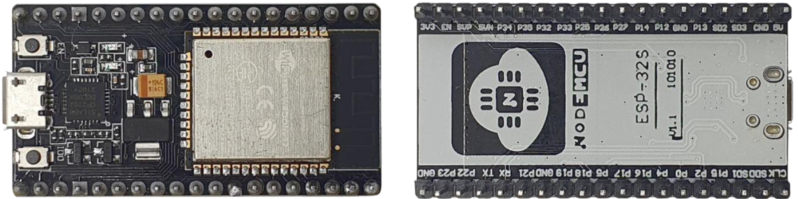
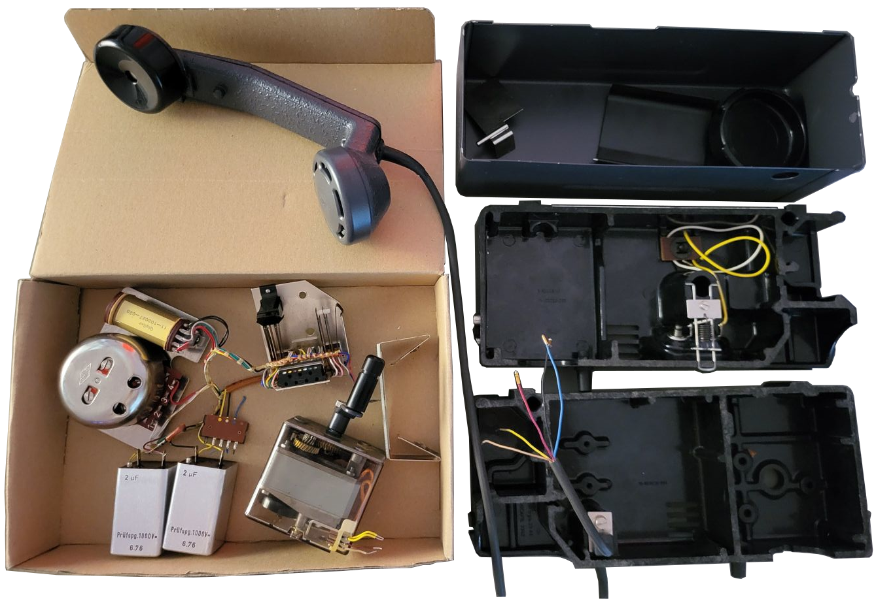
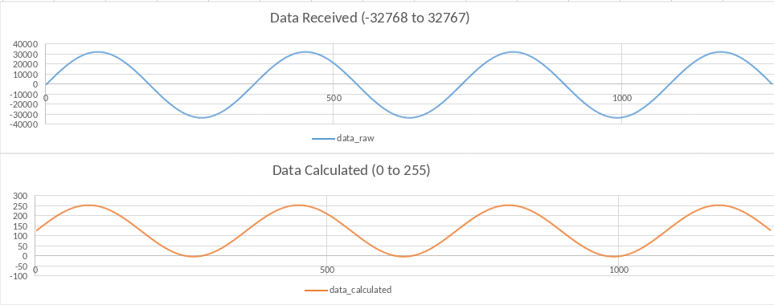
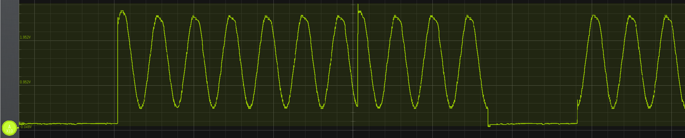

# Field Phone

_Fig. 1: photo of the field phone_

In our scout hut, I randomly stumbled across some old military field phones (Field Phone A.Tf.-53). I decided to try and
transform one of these to being able to receive (and maybe also send) audio via bluetooth.

_Fig. 2: front and back view of the ESP32 NodeMCU_

As MCU I used an ESP32 NodeMCU (_Fig. 2_) I had lying around (Development / DIY Board featuring an ESP-WROOM-32). It has got 
Bluetooth support and also features two built-in DAC's - that's all I really needed. A further pro of this 
microcontroller board is its Arduino Framework support.

## Old Field Phone Hardware

_Fig. 3: photo of the disassembled field phone_

First of all, I took apart the field phone. Its technology is quite simple: the audio recorded by the microphone is 
amplified using a type C battery's power. To make the other connected phone ring it uses an AC voltage generator 
(which you have to crank on).

## The Idea

The goal was to be able to use the field phone as an external speaker and microphone. I also wanted to build in a lipo 
battery I took out of a power bank, as well as its charging circuit. I hoped on being able to use the internal DAC of the 
ESP32.

## Mechanical

_Fig. 4: images of the mechanical parts_

_Fig. 5: STL preview of the 3D printed part that holds the charging circuit and USB slots_

To attach the charging circuit and the USB ports of the power bank, a friend of mine designed and 3D printed a part to
hold it (_Fig. 5_). This part exactly fits into the old battery holder slot and is therefore accessible from the outside by opening
a metal flap (_Fig. 4_).

## Software v0.0.1

To receive audio data via Bluetooth I decided to use the btAudio library. It is a combination of esp-idf components and
some useful things from the Arduino framework. It allows handling data by sending it to a further device using I2S or by
implementing the callback yourself.

Sending the data to the DAC is possible through different ways: The first and easiest is "Direct Voltage Output Mode"
where you hand over the next piece of information to the DAC, and it immediately outputs it. The second (and better) way
is "Continuous Analog Output With DMA". The data is transferred to the DAC in larger batches using DMA. However, I
couldn't use DMA, because the Arduino Framework implements an older version of the ESP-IDF which doesn't yet support DMA
and using the latest version of the ESP-IDF with its Bluetooth directly, I have got too less flash. So I used the
"Direct Voltage Output Mode".

I started by trying to receive data via Bluetooth. When setting up the device in I2S mode, everything seemed to work
just fine, however when I tried registering my own callback I couldn't connect to the ESP no more. After some testing
I figured out the issue was coming from the btAudio library: The esp-idf didn't like it when `i2s_set_sample_rates()` 
was called without I2S being enabled. This led to the device no longer reacting and therefore refusing the Bluetooth
connection to my phone. I created a fork of the btAudio repo and implemented a simple (and probably not the most 
beautiful) fix.

_Fig. 6: visualisation of the audio data before and after calculations_

Now receiving at least some data, I ran into the next issues. The data was transferred to me in a signed 16 bit 
(consisting of two related unsigned bytes) resolution. The DAC of the ESP can only output voltages from 0 to around VCC 
(3.3V) and has a maximum resolution of 8 bits. I converted the data format to being unsigned 8 bit and shifted it to
build a virtual zero at VCC/2 (_Fig. 6_).

Having the data in a suiting format, I stored it in a very basic fifo circular buffer, and now I'll just have to write 
it to the DAC now. I configured a timer so that it creates an interrupt every 22.7 us which brings us to 44'052 Hz (the 
audio data is 44.1 kHz). As it might already pop out, this will cause some issues: In theory the circular buffer would
overflow at some point. Disregarding this fact, I tested my field phone for the first time. In this test I was not using
a capacitor to filter out the DC parts of the output signal and I didn't amplify it either.

_Fig. 7: Sine Wave 440Hz recorded using a SmartScope USB-DSO_

Sine Wave 440Hz Audio file and DSO measurement (_Fig. 7_): [v0.0.1_400hz.wav](.github/readme/v0.0.1_400hz.wav). I also 
tried playing a song or listening to some recorded voice, but that sounded terrible.

The first results showed, that it was definitely possible to output audio via bluetooth using the internal DAC of an
ESP32. The next step would be to figure out, whether the cuts in the sine come from an overflow or lack of data in the
fifo. Optimizing the fifo to provide information about its fill level would be a good idea to start with.
